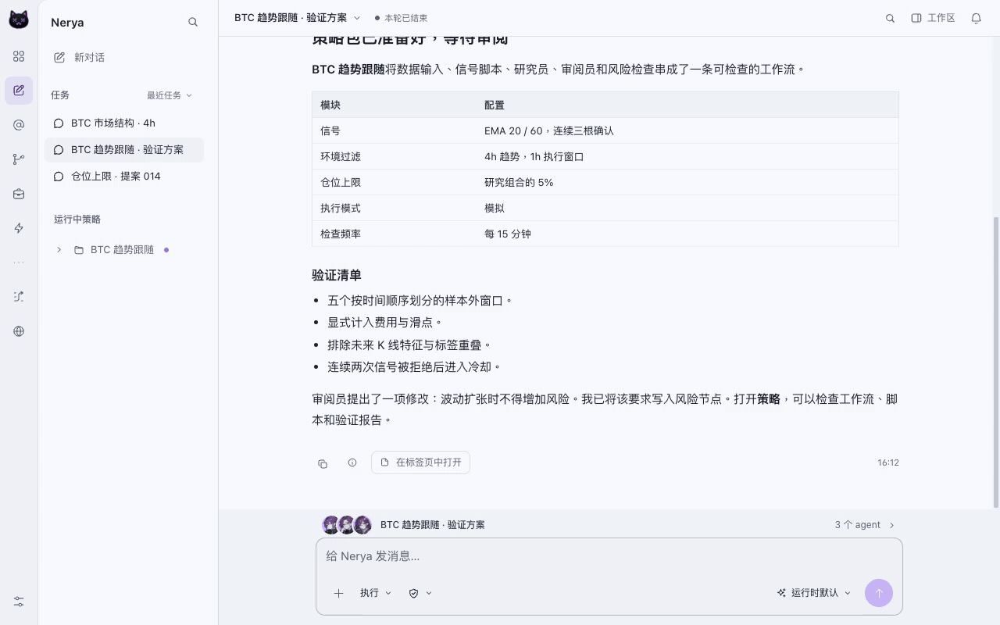

<div align="center">


# Nerya

### 一句想法，一支策略团队。

你的本地 Agent 策略工作区：在同一条对话中完成研究、策略构建、回测和复盘。

**1.0.0 Beta** · `1.0.0-beta.1`

[English](README.md) · [简体中文](README.zh-CN.md)

[官网](https://neryaai.github.io/) · [使用文档](https://neryaai.github.io/docs.html) · [桌面端下载](https://github.com/NeryaAI/Nerya/releases) · [构建状态](https://github.com/NeryaAI/Nerya/actions/workflows/desktop.yml)

[](https://github.com/NeryaAI/Nerya/actions/workflows/desktop.yml)
[](VERSION)
[](LICENSE)

</div>

你提出交易逻辑与约束，Agent 分工研究、编写策略并检查假设。你可以看到工具执行过程，查看证据，在对话中打开策略和回测详情，再决定下一步怎么做。

<picture>
  <source media="(prefers-color-scheme: dark)" srcset="branding/screenshots/1.0.0-beta/strategy-zh-dark.gif" />
  
</picture>

*素材录制自官网的隔离演示工作台，使用示例数据，不连接真实账户，也不代表已验证的投资收益。[查看素材来源](branding/screenshots/1.0.0-beta/README.md)。*

## 从一个想法，到每一步都有据可查

**说出想法，开始构建。** 描述目标市场、入场与出场条件、时间范围和风险约束。Agent 准备策略包并执行校验。纯脚本策略、脚本驱动 Agent 策略和事件驱动 Agent 策略共用同一工作区，保留可读的工作流节点、参数和运行记录。

**让 Agent 分工研究。** 研究员分别分析行情、新闻和技术信号，审阅员检查假设，协调 Agent 汇总证据。研究资料和报告可以直接打开，不必离开当前对话重新寻找上下文。

**结果不止一段文字。** 策略卡片、回测曲线、行情图表和完整投研报告都能出现在对话中，并在工作区标签页中展开。回测详情包含已有的历史 K 线、买卖标记、保护价位、交易明细和执行证据；数据缺失会明确展示，不把不完整结果包装成完整回测。

**查看记录，再做改动。** 可以回到某次运行，检查日志和执行过程。按需开启复盘计划，让 Agent 根据证据提出建议和候选改动。策略复盘、交易授权与普通资源编辑是不同流程：Skill 和 Agent 资源可以直接编辑保存。

**把工作区留在本地。** 策略、历史行情缓存、报告和配置保存在自己的工作区，账户凭据加密存入本地 Vault，并通过引用传递。使用外部模型、行情服务或工具时，仍会向相应服务发送执行任务所需的请求；本地存储不等于全部离线。

## 1.0.0 Beta 包含什么？

| 模块 | 工作区能力 |
| --- | --- |
| Agent 对话 | 流式回复、模型提供的思考输出、工具执行、进度、追加消息和错误恢复 |
| 策略 | 脚本与 Agent 执行、定时器／事件工作流节点、编辑、导入导出和运行详情 |
| 回测 | 可复用的本地历史数据、运行前检查、覆盖情况、分品种图表和交易记录 |
| 投研 | 行情卡片、技术图表、带证据的报告和多 Agent 协作 |
| 技能与 Agent | `SKILL.md` 规范、按需加载参考资料、可复用脚本和直接编辑保存 |
| 接入 | 模型服务、交易所／钱包连接、MCP 和外部 Agent 接入 |
| 桌面端 | Tauri 外壳，内置 Python、Node、Web 工作台及 Chromium；三平台原生构建流水线 |
| 界面 | 中英文、明暗主题、工作区标签页及集中管理模型与账户的设置页 |

研究市场与交易接入范围不能混为一谈。加密货币交易所使用已配置的连接器；钱包和预测市场操作取决于对应服务与凭据。期货、A 股研究示例不表示所有券商、订单类型或品种都已经能够执行交易。

## Avalanche 与 LFJ

Avalanche 是 Nerya 原生 Agent 工作区新增的一类市场接入，不需要另一套 Dashboard 或运行时。

- Avalanche C-Chain（`43114`）直接复用 Nerya 现有的 EVM、钱包和链上数据能力。
- 内置 `avalanche_lfj_market` 工具会读取当前 LFJ Router 及 V2.1 / V2.2 USDC/WAVAX 池，在同一区块比较不同订单规模，并把报价作为原生对话卡片展示。
- LFJ 市场工具默认只读：不会加载签名器、授权代币或广播交易；任何执行动作前都必须重新获取报价。
- `examples/avalanche/avax_breakout_zh/` 提供一个普通 Nerya 策略包示例，展示 AVAX 日线突破、按净资产比例仓位、回测和复盘配置如何进入现有策略工作流。

真正的资金执行仍然经过 Nerya 已有的账户、风险和审批链路。本仓库里的第一方 LFJ 适配目前以市场发现和报价为主，不会因为启用了 Avalanche 支持就自动打开主网交易。

## 安装桌面端

进入 [GitHub Releases](https://github.com/NeryaAI/Nerya/releases)，选择一个**已完成发布**的版本，下载与系统及处理器匹配的安装包。

| 平台 | 架构 | 发布文件 |
| --- | --- | --- |
| macOS | Apple Silicon / ARM64 | `.dmg`、`.pkg` |
| macOS | Intel / x64 | `.dmg`、`.pkg` |
| Windows | x64 | NSIS `.exe`、Windows Installer `.msi` |
| Linux | x64 | `.deb`、`.AppImage` |

桌面安装包携带应用所需的 Python、Node、Web 服务和浏览器引擎，使用时不需要安装开发工具链。Windows 安装包包含离线 WebView2 安装器。Linux 仍依赖发行版提供的桌面和浏览器系统库，当前构建基线为 Ubuntu 22.04。详细说明见 [桌面端安装与构建文档](desktop/README.md)。

默认 Beta 流水线使用 macOS ad-hoc 签名，Windows 安装包未签名，除非另外接入正式签名流程。它们**不等同于**经过 Apple Developer ID 公证或获得 Windows 信誉认可的安装包。请遵循操作系统及组织的安全政策，不要为了安装不可信版本关闭系统安全保护。

首次启动时配置模型，按需连接交易账户，并为外部访问配置管理员密码。新工作区**不预置策略或定时交易任务**。后续可以在设置中修改模型、账户和访问选项；升级不会静默清空已有工作区。

## 试试第一个任务

> 使用已有历史数据研究 BTC/USDT。创建一个有明确入场和出场规则的脚本策略，完成校验并运行历史回测。展示策略工作流、数据覆盖情况和交易明细，不要启动实盘交易。

也可以先做纯投研：

> 对比 BTC 与 ETH 当前的市场状态。让研究员分别分析价格行为和新闻，引用证据，输出带行情图表的研究报告，并说明缺失的数据。

模型能否调用、行情能否获取取决于你配置的服务。回测是历史模拟，不代表未来收益。启动执行前，请检查策略代码、参数、数据覆盖、手续费和交易权限。

## 从源码运行

源码方式适用于开发与服务端部署。Node 和 Python 版本分别固定在 `.node-version` 与 `.python-version`。

```bash
git clone https://github.com/NeryaAI/Nerya-Avalanche.git
cd Nerya-Avalanche
uv venv
uv pip install -e ".[dev,mcp,trading,prediction,browser]"
npm ci
npm --prefix desktop ci
```

启动桌面开发模式：

```bash
npm --prefix desktop run dev
```

桌面启动器负责管理本地服务。源码构建还需要 Rust 和对应平台的原生构建依赖。纯 Web 部署可参考现有 [CLI / MCP 指南](MCP.md) 及 `nerya --help`；Web 工作台仍可独立于 Tauri 使用。

## 构建、校验与发布

```bash
python scripts/release_version.py
npm run typecheck --workspace @nerya/dashboard
npm run check:i18n --workspace @nerya/dashboard
python -m unittest discover -s desktop/tests -v
npm --prefix desktop run build
python desktop/scripts/verify_runtime.py
python desktop/scripts/smoke.py --access-port 0
```

Python 命令应在项目虚拟环境中运行。macOS 构建应用后还可以执行 `node desktop/scripts/installer.mjs` 生成 `.pkg`。[桌面文档](desktop/README.md) 包含各平台的完整打包命令和安装包校验方式。

[桌面 CI/CD](.github/workflows/desktop.yml) 分别使用 Windows、Linux、Apple Silicon Mac 和 Intel Mac 构建，检查版本一致性、锁定依赖、前端类型、Python 分发内容、桌面单元测试和打包后的运行时。安装包测试使用临时工作区与测试凭据，不调用真实模型、不执行交易；Rust 编译成功并不意味着安装包已经通过验证。

推送与 `VERSION` 一致的标签，例如 `v1.0.0-beta.1`，即可请求发布。只有必需的流水线任务全部通过，发布任务才会上传安装包、SHA-256 校验和与构建元数据。普通提交和 Pull Request 只构建产物，不发布版本。原生通知授权、系统信任提示和各交易服务的实盘接入仍需要分别验收。

## 项目结构

```text
nerya/              Python Agent 运行时、API、连接器与交易服务
nerya/skills/       内置 SKILL.md 技能、参考资料和执行脚本
nerya/sdk/          运行时策略、交易和触发器 API
sdk/               Python 与 TypeScript 客户端 SDK
dashboard/         Next.js 对话与策略工作台
desktop/           Tauri 外壳、便携运行时打包与原生冒烟测试
tests/             运行时回归测试
.github/workflows/ 校验、桌面原生构建与版本发布
```

## 安全与许可

实盘执行需要相应配置与授权，请勿绕过交易风险和审批检查。Vault 加密保护落盘凭据，不能阻止已被攻破的运行进程读取数据。备份工作区及加密密钥，不要将账户密钥、`.env` 文件或真实交易状态提交到 Git。

Nerya 使用 [PolyForm Noncommercial 1.0.0](LICENSE) 许可证，商业使用需要单独授权。安装包内的第三方组件保留各自的许可。此 Beta 版本用于研究和策略操作，不构成投资建议，也不保证避免资金损失。
